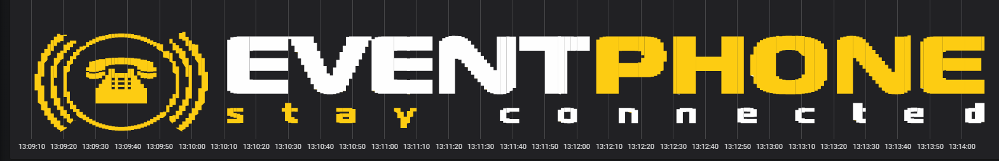
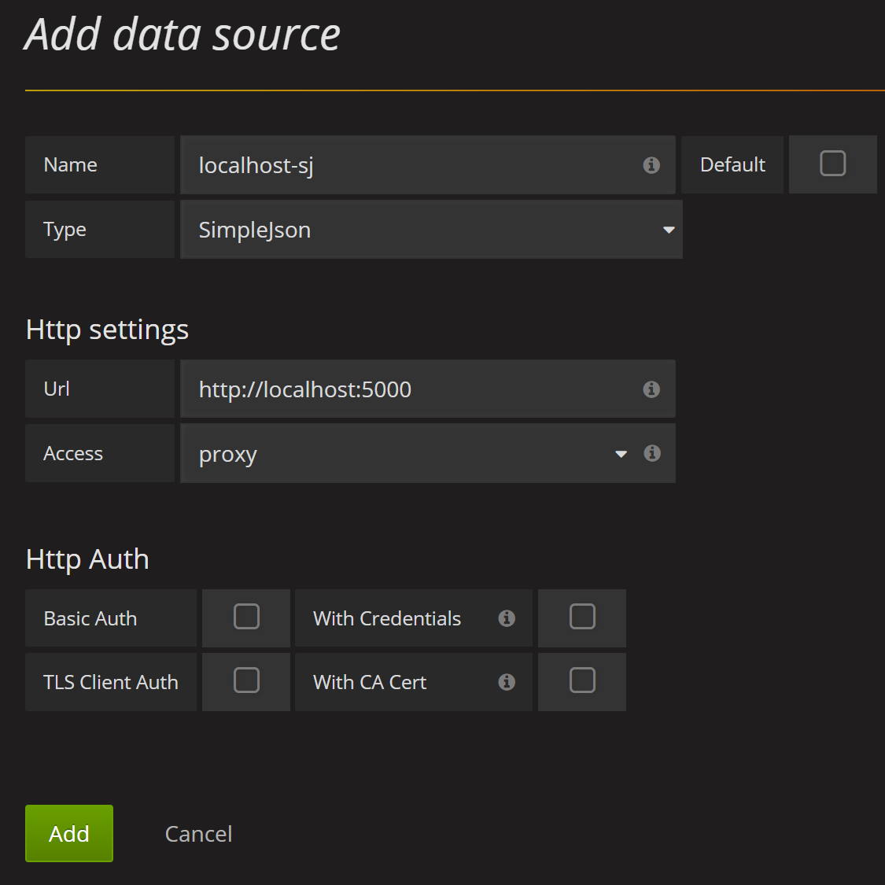
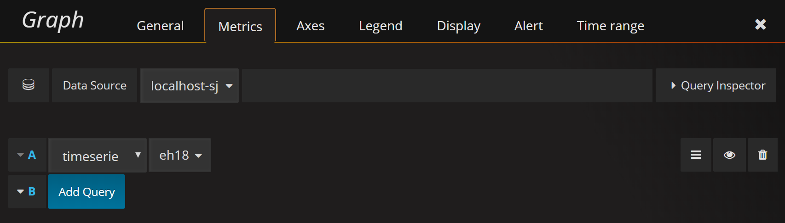
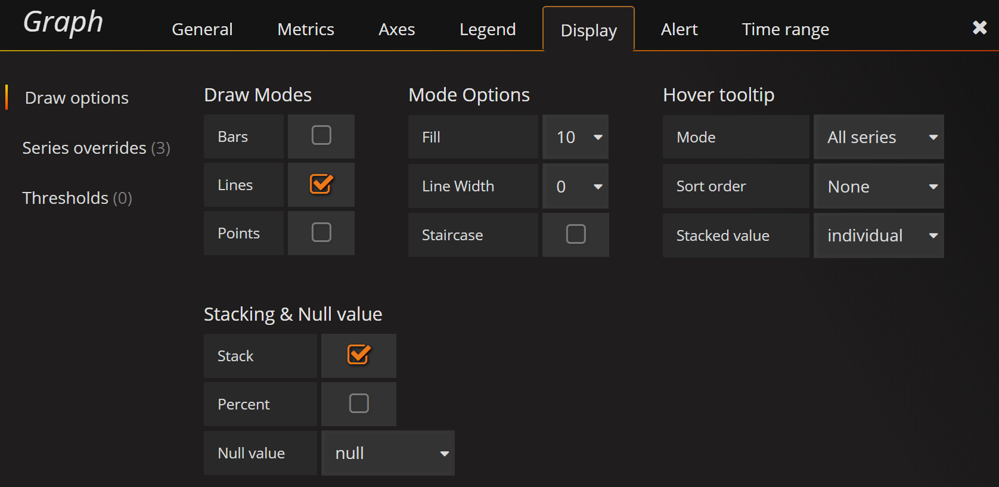
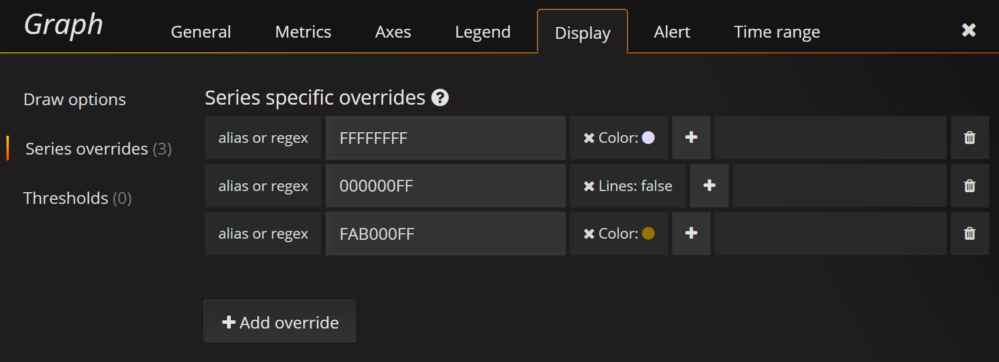

[](https://ci.appveyor.com/project/eventphone/grafana-logo/branch/master)

## What?
This is a small webservice implementing a graphite and grafana SimpleJson endpoint to render logos on your dashboards. This project was inspired by [Monitoring Art](https://github.com/monitoringartist/grafana-monitoring-art).

## Why?
Because it's possible.

## Can I take a look?


Also checkout the dashboards from [#eh18](https://youtu.be/5eguMOTkq_8).

## How

#### run from release
- download [latest release](https://github.com/eventphone/grafana-logo/releases/latest)
- install [aspnetcore runtime](https://www.microsoft.com/net/download)
- unzip
- `dotnet grafana-logo.dll`

#### or run from source
``` sh
$ git clone https://github.com/eventphone/grafana-logo.git
$ cd src/grafana-logo
$ dotnet run
```
#### install [SimpleJson Plugin](https://grafana.com/plugins/grafana-simple-json-datasource/installation)
SimpleJson supports millisecond resolution. With graphite the logo may be pixelated.



``` sh
grafana-cli plugins install grafana-simple-json-datasource
```
#### add a datasource to grafana
* Name: choose a meaningful name
* Type: SimpleJson
* Url: http://localhost:5000
* Access: proxy

The latest version also supports Graphite as type, but the logo may have a lower resolution for short time ranges (e.g. 5 minutes)



#### upload your logo image
```sh
cd src/grafana-logo/wwwroot/images
wget https://github.com/eventphone/grafana-logo/raw/master/src/wwwroot/images/eventphone_logo_schriftzug.png
```

#### create a new graph
* Datasource: your meaningful name
* Metric: timeseries - filename of your logo



* switch off legends: Legend -> Show
* enable stack: Display -> Stack
* remove lines: Display -> Line Width -> 0)
* add color: Display -> Fill -> 10



* add overrides:
  * Display -> Series override
  * add an override for each color
    * alias or regex: select color code
    * \+ color: set the color code from the name
  * set Lines=false for the background color

